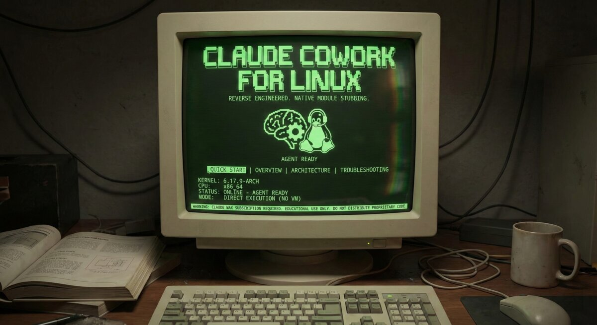

# Claude Cowork for Linux



Run the official Claude Desktop (macOS Electron app) on Linux with Cowork support.

> **WIP**: This is a personal experimental project. It may not work correctly.

Fork of [johnzfitch/claude-cowork-linux](https://github.com/johnzfitch/claude-cowork-linux).

## Install

```bash
git clone https://github.com/noppomario/claude-cowork-linux.git
cd claude-cowork-linux
./install-oneclick.sh
```

### Requirements

- Linux (tested on Fedora 43 / GNOME / Wayland)
- Node.js >= 18
- Electron, 7zip (or p7zip)
- ~500 MB disk space

## Usage

```bash
claude-desktop                # Normal launch
claude-desktop --debug        # Enable trace logging
claude-desktop --devtools     # Enable Chrome DevTools
```

Logs: `~/Library/Logs/Claude/startup.log`

## Uninstall

```bash
sudo rm -rf /Applications/Claude.app
sudo rm /usr/local/bin/claude-desktop
rm -rf ~/Library/Application\ Support/Claude
rm -rf ~/Library/Logs/Claude
rm -rf ~/Library/Caches/Claude
rm ~/.local/share/applications/claude.desktop
```

## License

MIT License - see [LICENSE](LICENSE)

## Disclaimer

This is an unofficial community project. Claude Desktop is a product of Anthropic.
This project only provides compatibility layers to run the official app on Linux.
